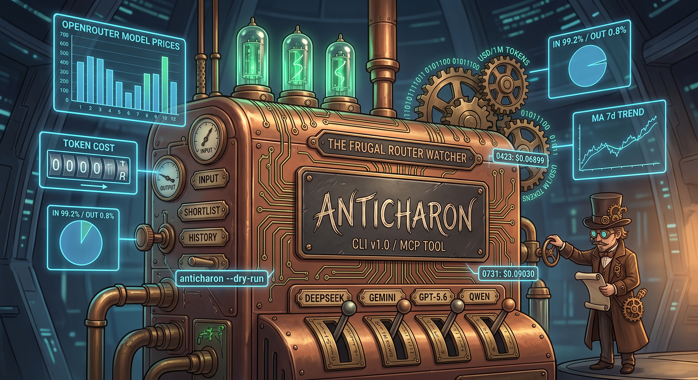

# Anticharon 🪙⚖️ (v0.5.2)

[](CHANGELOG.md)
[](LICENSE)
[](https://github.com/parisneto/anticharon/actions)

<p align="center">
  
</p>

> **The ferryman who minimizes the fare instead of demanding toll.**
> An ultra-lightweight, resilient OpenRouter API price tracker, volatility detector, and token cost optimizer for **Hermes Agent** and automated LLM workflows.

---

## 📖 The Mythos

In Greek mythology, **Charon** is the grim ferryman who demands an obol coin toll to carry souls across the rivers Styx and Acheron. In modern agentic AI systems, every prompt expansion, reasoning chain, and tool history represents an accumulating token toll.

**Anticharon** is the counter-agent: the vigilant watcher that monitors OpenRouter model pricing, computes weighted prompt/completion blended costs, detects unexpected price spikes or promotional drops, and ensures your agents always cross the token river for the lowest possible toll.

---

## ✨ Key Features

- **Blended Weighted Pricing:** Calculates realistic cost per 1M tokens based on your agent's actual prompt vs completion ratio (calibrated default: **99.71% input / 0.29% output**).
- **Backed by 114 Billion Tokens of Empirical Science:** Why do pricing calculators assume a 50/50 token mix? Autonomous agents (Hermes, Claude Code, Cursor, Codex) don't chat—they work. They consume massive contexts (system prompts, workspace trees, code snippets, git logs) and output concise tool calls and surgical diffs. We validated our default calibration against University of Washington's research paper [*"TraceLab: Characterizing Coding Agent Workloads for LLM Serving"*](https://syfi.cs.washington.edu/blog/2026-06-25-tracelab/) ([live demo](https://tracelab.cs.washington.edu/), [GitHub](https://github.com/uw-syfi/TraceLab)). Across **114.2 billion input tokens** and **391.8 million output tokens** (a **291.5 to 1 ratio**), the academic dataset recorded 99.66% input / 0.34% output—differing from Anticharon's operational baseline by **only 0.05% (-0.0005)**. We did the heavy lifting so you and your agents get real-world mathematical accuracy out of the box!
- **Eliminates AI Cost Anxiety & Slop:** When you know true blended costs, price hikes don't terrify you, and promotional windows don't deceive you. Developers and agents can deploy frontier models responsibly within a sensible personal budget.
- **TUI ASCII Price Spectrum Chart:** Instant visual ASCII bar chart in every run showing relative pricing distribution from `▲ Cheaper` to `▼ More Expensive`, badging `🏆 [BEST]` and `★ [DEFAULT]`.
- **Catalog Search & Filter (`anticharon model discover`):** Filter OpenRouter's entire catalog (~417+ models) by keyword substring match, output modality (`--modality text`), promotional / free flags (`--promo`), and price threshold expressions (`--filter "price < 10"`) — plain criteria matching, sorted cheapest-first. No AI ranking, curation, or recommendations.
- **Model Shortlist Management (`anticharon model add / remove / list`):** Manage your configuration right from the terminal with live catalog slug validation and `--dry-run` safety.
- **One-Command Calibration (`anticharon calibrate`):** Directly ingest CSV log exports from OpenRouter to automatically calculate and save your exact prompt/completion mix for better life quality. Remember: Y.M.M.V. (Your Mix May Vary).
- **Moving Average & Volatility Detection:** Tracks 3-day and 7-day moving averages (`MA_3d`, `MA_7d`) to trigger instant `PRICE_SPIKE`, `PRICE_DROP`, and `BEST_OPTION_CHANGED` alerts. No Scientific Analysis here just simple moving averages and threshold based logic.
- **Compact Historical Storage:** Keeps a clean, 1-line-per-model sliding CSV history (`history.csv`) with automatic cold-start padding.
- **Resilient & Safe:** 10-second API timeouts with graceful fallback to local cache when offline or rate-limited.
- **Built-in Self-Test (`anticharon test`):** Instant pre-flight checks validating runtime environment, dependencies, math calculations, and network access.
- **Fast, Zero-Bloat Distribution:** Managed with `uv`, runnable as a standalone CLI or directly installed from Git.

### 🔬 The Heavy Lifting: Calibrated Against 114 Billion Tokens of Empirical Research

Most pricing calculators deceive developers by advertising cheap input prices while hiding exorbitant completion rates—or scaring them away from frontier models by quoting $15/1M output prices as if agents output as much as they read.

Real-world coding agents exhibit **extreme input dominance**:

| Metric | UW TraceLab Dataset (114.6B Tokens) | Anticharon Calibrated Baseline | Difference |
| :--- | :--- | :--- | :--- |
| **Input (`weight_prompt`)** | `0.9966` (99.66%) | `0.9971` (99.71%) | `-0.0005` (-0.05%) |
| **Output (`weight_completion`)** | `0.0034` (0.34%) | `0.0029` (0.29%) | `+0.0005` (+0.05%) |
| **Input-to-Output Ratio** | **291.5 : 1** | **339.5 : 1** | *Extreme Input Dominance* |

*Source:* [University of Washington SyFi Lab — TraceLab (Sep 2025 – Jul 2026)](https://syfi.cs.washington.edu/blog/2026-06-25-tracelab/).  
**The Takeaway:** Anticharon arrives out of the box pre-tuned to empirical reality, while giving you `anticharon calibrate` whenever you want to calibrate against your personal logs in 1 second.

---

## 🚀 Installation & Distribution

### 1. For Agents & End Users (Direct from Git)
Install and run `anticharon` directly without manually cloning the repository:

```bash
# Using uv tool (recommended)
uv tool install git+https://github.com/parisneto/anticharon.git

# Or via uv pip in an active environment
uv pip install git+https://github.com/parisneto/anticharon.git
```

### 2. For Contributors & Local Development
```bash
git clone https://github.com/parisneto/anticharon.git
cd anticharon

# Initialize virtual environment and dependencies
uv sync
```

---

## 💻 CLI Usage

### Run Price Tracking
```bash
# Standard run: auto-detects Hermes models, fetches OpenRouter, updates history, prints report & ASCII price chart
uv run anticharon run

# Dry-run / Check: calculates prices without saving to disk
uv run anticharon check --dry-run

# Explicit Hermes config path or standalone mode without Hermes
uv run anticharon run --hermes-config /path/to/hermes/config.yaml
uv run anticharon run --no-hermes

# Output structured JSON (ideal for Hermes or script piping)
uv run anticharon run --json
```

### Hermes Agent Auto-Detection & Model Ingestion
When deployed alongside **Hermes Agent** (e.g. in a remote VM or local agent environment), Anticharon automatically detects Hermes's active model (`default:`) and OpenRouter fallback models:
```bash
# Explicitly import Hermes models into Anticharon shortlist (read-only on Hermes)
uv run anticharon model import-hermes   # or: uv run anticharon model sync

# Preview model import without modifying shortlist.json
uv run anticharon model import-hermes --dry-run

# Custom Hermes config path
uv run anticharon model import-hermes --hermes-config /custom/path/to/config.yaml
```

### Catalog Search & Filtering
```bash
# Filter models by family / name (substring match)
uv run anticharon model discover "gemini"

# Filter for promotional and free (:free, $0.00) models
uv run anticharon model discover --promo

# Multi-criteria filtering (provider, modality, price threshold expressions)
uv run anticharon model discover "qwen" --modality text --max-price 0.50
uv run anticharon model discover --promo --filter "openai" --filter "anthropic"
uv run anticharon model discover --filter "gemini" --filter "price < 0.20"
```

### Manage Shortlisted Models
```bash
# List current shortlist
uv run anticharon model list

# Add a model with live catalog validation (or preview with --dry-run)
uv run anticharon model add "google/gemini-3.7-flash"
uv run anticharon model add "google/gemini-3.7-flash" --dry-run

# Remove a model from shortlist
uv run anticharon model remove "minimax/minimax-m2.7"
```

### Run Environment, Network & Hermes Self-Test
```bash
uv run anticharon test
```

### Calibrate Token Weights from OpenRouter Activity Logs
1. Go to OpenRouter: **Sidebar Logs** (`https://openrouter.ai/logs`)
2. Select your timeframe on the top right (e.g. **Past 1 Month**)
3. Click the **3 dots menu** → **Export** to download the CSV file.
4. Run Anticharon:
```bash
# Ingest log and automatically update your shortlist.json config
uv run anticharon calibrate path/to/openrouter_activity.csv

# Or inspect the calculated ratio without modifying configuration
uv run anticharon calibrate path/to/openrouter_activity.csv --dry-run
```

---

## ⚙️ Configuration (`shortlist.json`)

Anticharon looks for configuration in:
1. Environment variable `ANTICHARON_CONFIG` (if set)
2. `~/.hermes/price_tracker/shortlist.json`
3. Local `./config/shortlist.json` (fallback)

### Example `shortlist.json`:
```json
{
  "shortlist": [
    "deepseek/deepseek-v4-flash-0731",
    "deepseek/deepseek-v4-flash-0423",
    "qwen/qwen3.7-flash",
    "openai/gpt-5.6-luna",
    "google/gemini-3.1-flash-lite",
    "minimax/minimax-m2.7",
    "google/gemini-2.5-flash-lite"
  ],
  "weight_uncached_prompt": 0.2326,
  "weight_cached_prompt": 0.7645,
  "weight_completion": 0.0029,
  "spike_threshold_pct": 20.0,
  "min_tracking_days_for_profile": 14
}
```

---

## 🤖 Hermes Agent & Cron Integration

Run Anticharon daily via cron to alert Hermes or generate reports:

```bash
# Run daily at 08:00 UTC and save JSON output
0 8 * * * anticharon run --json > ~/.hermes/price_tracker/latest_prices.json
```

---

## 🔌 Model Context Protocol (MCP) Server

Anticharon natively exposes an MCP server over `stdio` for **Hermes Agent**, **Claude Desktop**, and any standard MCP client.

### MCP Tools:
- `check_prices`: Fetches live OpenRouter prices for your shortlist, calculates weighted blended rates, 7-day moving averages, alerts (`PRICE_SPIKE`, `PRICE_DROP`, `BEST_OPTION_CHANGED`), and attaches 30-day intelligence profiles. Automatically maintains a compact local `shortlist.json` and `history.csv` of your favorite models, empowering agents to switch smoothly, eliminate cost anxiety, and dodge the ferryman's toll!
- `get_model_history`: Audits 30-day historical trajectories, CV% volatility, and trend sparklines from your local storage (JSON or raw CSV).
- `discover_models`: Live multi-criteria catalog search across ~417+ models with real-world blended pricing.
- `import_hermes_models`: Imports active default and fallback models from Hermes `config.yaml` into Anticharon's shortlist. Strictly read-only on Hermes. Default is `dry_run=True` (preview only); set `dry_run=False` to save to shortlist.

> [!TIP]
> **🔒 Safe-by-Default Hermes Ingestion:** `import_hermes_models` is strictly **one-way and read-only** on Hermes Agent (`~/.hermes/config.yaml`). It never touches or mutates your Hermes configuration. In MCP tool calls, `dry_run=true` is the default to prevent unexpected disk writes.

### MCP Resources:
- `anticharon://llms.txt`: Machine-readable Agent-to-Agent briefing.
- `anticharon://history.csv`: Raw 30-day sliding history data table.
- `anticharon://shortlist.json`: Active configuration and calibrated weights.

### MCP Prompts:
- `cost_spike_triage`: Guided triage when a price hike or expired promotional window occurs.
- `model_migration_advisor`: Guided migration when an active model is flagged as `SUNSETTING`.
- `family_upgrade_discover`: Discovers newer generation sibling models in the same provider family.
- `daily_cost_briefing`: Generates a 3-bullet executive briefing of price movements and alerts.
- `budget_optimization_audit`: Audits your shortlist to identify cost outliers and optimize fallback ordering.

### 📊 Real-World Case Study: Gemini 3.7 vs 3.8 Upgrade Detection

During live MCP Inspector validation across 30 days of price data:
- **`google/gemini-3.7-flash`:** Price jumped from `$0.379` to `$0.759` (+100.0%). Anticharon flagged it as `📈 PROMO_ENDED` and `⚠️ SUNSETTING`.
- **Automatic Sibling Alternative:** Anticharon detected that `google/gemini-3.8-flash` was available at the exact same price (`$0.75881/1M`), delivering an actionable recommendation:
  > *"Introductory promo ended (+100.0%). Sibling google/gemini-3.8-flash active at same/lower price ($0.759). Migrate to google/gemini-3.8-flash."*
- **Outcome:** Your agent receives pre-digested intelligence to switch to the newer model version instead of blindly running legacy models at doubled prices.

<p align="center">
  
</p>

### Host Configuration:

#### Hermes Agent (`~/.hermes/config.yaml`):
```yaml
mcp_servers:
  anticharon:
    command: "uvx"
    args: ["--from", "git+https://github.com/parisneto/anticharon.git", "anticharon", "mcp"]
```
*For local dev within repo clone:*
```yaml
mcp_servers:
  anticharon:
    command: "uv"
    args: ["--directory", "/path/to/anticharon", "run", "anticharon", "mcp"]
```

#### Cursor IDE & Antigravity (`.cursor/mcp.json` or `~/.gemini/config/mcp_config.json`):
```json
{
  "mcpServers": {
    "anticharon": {
      "command": "uvx",
      "args": ["--from", "git+https://github.com/parisneto/anticharon.git", "anticharon", "mcp"]
    }
  }
}
```
*For local development in a repository clone (no global installation required):*
```json
{
  "mcpServers": {
    "anticharon": {
      "command": "uv",
      "args": ["--directory", "/path/to/anticharon", "run", "anticharon", "mcp"]
    }
  }
}
```
*(Or via direct virtual environment: `"command": "/path/to/anticharon/.venv/bin/python"`, `"args": ["-m", "anticharon", "mcp"]`)*

#### Claude Desktop (`claude_desktop_config.json`):
```json
{
  "mcpServers": {
    "anticharon": {
      "command": "uvx",
      "args": ["--from", "git+https://github.com/parisneto/anticharon.git", "anticharon", "mcp"]
    }
  }
}
```

#### In-Band A2A Semantics (`_hints`):
Tool responses include an in-band `_hints` dictionary declaring key definitions:
- `data_source`: `"live_api"` or `"cached_history"`
- `api_offline_fallback`: Explicit boolean declaring HTTP cache fallback. **Note:** This has *no relation* to Hermes model `fallback_providers`.

### 🛠️ Interactive Testing with MCP Inspector

You can visually test and debug all Anticharon MCP tools, resources, and prompts using the official Model Context Protocol Inspector:

```bash
# Launch with the helper script:
./scripts/inspect_mcp.sh

# Or directly via npx:
npx @modelcontextprotocol/inspector uv --directory . run anticharon mcp
```

---

## 📄 License & Author

MIT License. Copyright (c) 2026 Páris Piedade Neto.
Connect on [LinkedIn](https://www.linkedin.com/in/parisneto/).

---

## 🤝 Contributing & Community

Anticharon is built for the agentic developer community. Contributions, suggestions, and model discovery profiles are welcome!

- **Found a bug or price discrepancy?** Open an [Issue](https://github.com/parisneto/anticharon/issues).
- **Want to add a feature or provider filter?** Fork the repo, create a branch, and submit a [Pull Request](https://github.com/parisneto/anticharon/pulls).
- **Code Standards**: Anticharon follows spec-driven development, deterministic `pytest`-based testing, and plain Markdown math. Always run `uv run pytest` before submitting a PR.
