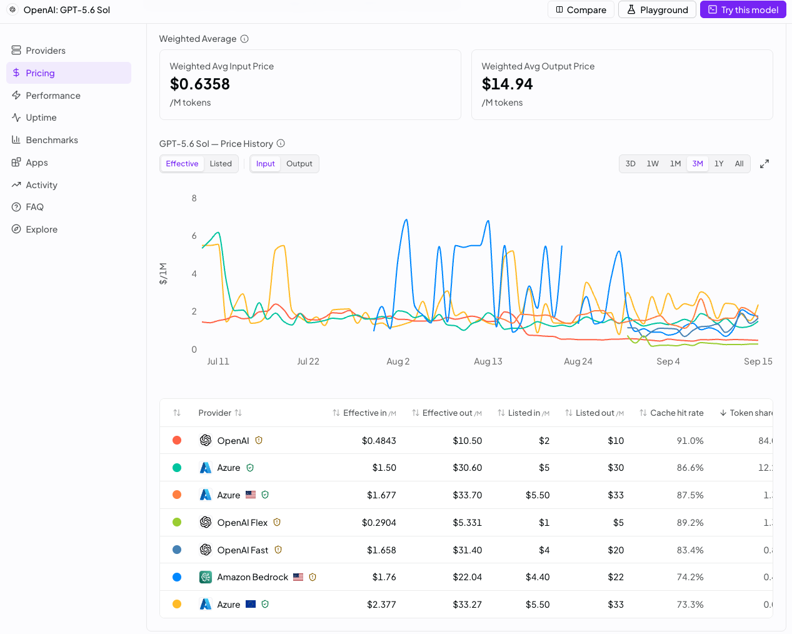
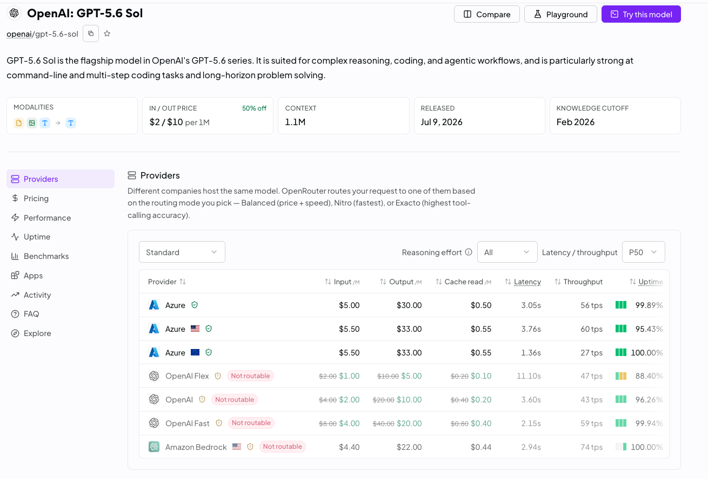
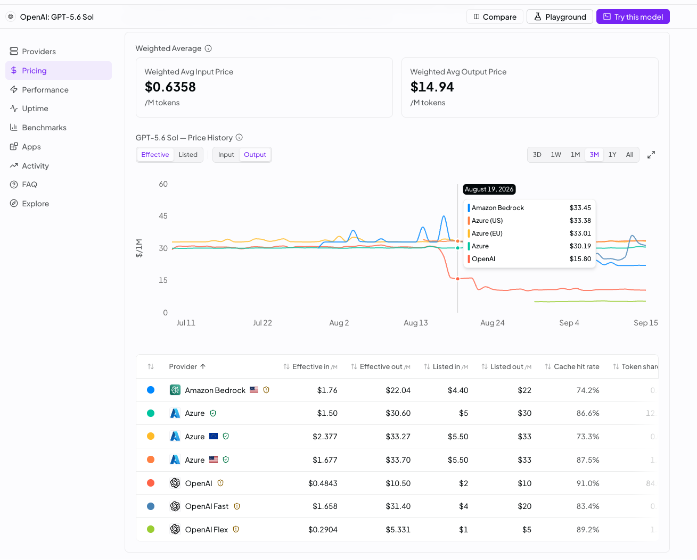
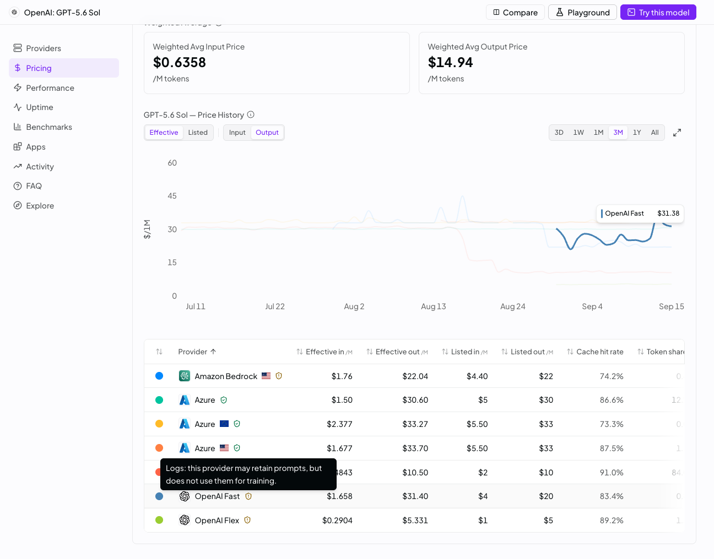

# ADR Candidate: Cache-Aware Token Blending & Provider-Routable Pricing Engine

- **Document ID:** ADR-2026-0002-TOKENS-CACHED
- **Status:** Candidate / Proposed (Definition of Done Experiment)
- **Written By:** Anticharon Architecture & Intelligence Lab
- **Reviewed By:** Paris Neto
- **Timestamp:** 2026-09-15 17:05:00 UTC-03:00
- **Scope:** `src/anticharon/log_parser.py`, `src/anticharon/tracker.py`, `src/anticharon/models.py`, `src/anticharon/storage.py`, `docs/specs/spec_v1_anticharon.md`
- **Associated Evidence:** private lab prototypes and screenshots (not committed to git — see `docs/plans/pricing-engine-v2/PLAN.md` for a description of what they validated). The four figures embedded below have been promoted into this directory so this document is self-contained for anyone reading the public repo.

> **Editorial note (2026-09-15):** this file is the original candidate ADR, lightly edited to (a) remove references to private/uncommitted local paths per AGENTS.md Rule 12, (b) correct the version-bump target below (the repo is already at v0.4.3, not v0.4.0), and (c) flag one direct conflict with `EXECUTION_CONTRACT.md`, which is now the authoritative synchronized source — see the note under §4 Non-Goals. No other content has been changed. This document has not been formally promoted to `docs/specs/adr/`; it remains a candidate feeding `PLAN.md`.

---

## ⚡ MANDATORY TL/DR SECTION (ADHD-Friendly & Synchronized)

> [!IMPORTANT]
> **Core Finding:** Anticharon currently overestimates real-world agent deployment costs by **55% to 75%** by modeling input tokens solely at standard list rates without factoring in prompt caching (`tokens_cached`). Simultaneously, headline catalog cards often display introductory or non-routable baseline rates; when user accounts enforce compliance guardrails (such as Zero Data Retention / ZDR), certain providers may be flagged as non-routable (status: -2), routing requests to higher-priced compliant enterprise endpoints (e.g. Azure in this specific case study, among others) and noticeably altering effective unit economics.

### 1. Anticharon Feature Chosen for This Plan
**Main Price Retrieval Engine and its Upstream Use Across the Entire Anticharon Logic:**
- OpenRouter API model catalog & endpoints retrieval.
- Token weight calibration from activity logs.
- Blended price calculation (`current_price_1m`), moving averages (`ma_3d`, `ma_7d`), and 30-day analytics.

### 2. Outcome Definition
An expanded pricing retrieval, storage, and calculation engine supporting:
1. **3-Component Cached-Token Pricing:** Accurately models `(uncached_prompt, cached_prompt, completion)`.
2. **Provider-Aware Routable Pricing:** Distinguishes advertised list price from actual routable floor (accounting for ZDR / status -2).
3. **Realistic Golden Test Cases:** Pre-calculated golden fixtures verifying formula correctness across 5 real agent usage patterns.
4. **Definition of Done Formula:**
   > *"Cached-token calculations are complete when realistic fixture payloads exercise the full supported pricing paths; golden cases verify the formulas; mocked integration tests verify retrieval → parse → store behavior; defined failure cases verify fallback behavior; and the mandatory test suite passes without network access."*

### 3. Acceptance Criteria
- [ ] `parse_activity_log` extracts `tokens_cached` and outputs `weight_uncached_prompt`, `weight_cached_prompt`, `weight_completion`, and `cache_hit_rate`.
- [ ] `fetch_openrouter_models` captures `pricing.input_cache_read` (fallback: `0.10 × prompt` or full prompt if unavailable).
- [ ] Blended price formula computes: `(P_in × W_uncached) + (P_cache_read × W_cached) + (P_out × W_comp)`.
- [ ] Storage in `history.csv` preserves compact 1-line-per-model schema while holding calibrated true cost.
- [ ] All 5 Golden Pricing Cases pass deterministically in zero-dependency unit tests in < 2 seconds.
- [ ] Zero un-mocked network calls during CI / test execution.

> **Editorial note:** these criteria only cover the cached-token component. `EXECUTION_CONTRACT.md` §3 supersedes and broadens this list to also require explicit acceptance criteria for provider-routable pricing and 28-day historical backfill, which Outcome Definition item #2 above promises but this original checklist never actually tested. See `PLAN.md` for the reconciled, complete criteria.

### 4. Non-Goals (Still Open / Deferred for Future Planning Rounds)
- ❌ **No dynamic real-time provider switching inside agent sessions:** Anticharon advises and calculates; it does not proxy or reroute live API calls.
- ❌ **No schema expansion of `history.csv` to multi-column provider matrices:** Keep storage compact (K.I.S.S.).
- ~~❌ **No heavy test frameworks:** Retain lightweight, zero-dependency runner (`tests/run_tests.py` and `anticharon test`).~~
  **Superseded by `EXECUTION_CONTRACT.md` §2 (Mature Test Suite):** pytest is now the adopted standard for this feature and future behavioral testing, with fixtures, mocked integration tests, golden cases, and gated `@pytest.mark.live` tests. The old zero-dependency-only mandate (AGENTS.md Rule 8) is being amended for this project as part of this initiative. This line is struck through rather than deleted so the reversal is visible, not hidden.
- ❌ **Park adjacent discoveries:** Park 28-day historical web-scraping backfill and deep account guardrail token sync for a separate sprint.
  **Editorial note:** `EXECUTION_CONTRACT.md` §1 pulls 28-day historical backfill back **into** this initiative's scope (golden case #6, acceptance criteria "Retrieval and history"). This bullet is retained for historical record of the original candidate's framing, but `PLAN.md` follows the Execution Contract, not this line.

### 5. Timebox & Scope Guardrail
- **Timebox:** 1 focused development sprint.
- **Version target (corrected):** the repo is currently at v0.4.3; this is a MINOR feature addition (no breaking public-interface removal beyond the internal pricing formula) per AGENTS.md Rule 11, so the target is the next MINOR release (`v0.5.0`), not `v0.4.0` as originally drafted.
- **Guardrail:** Park every attractive adjacent discovery (e.g. prompt caching write amortization, reasoning token surcharges, `pricing.overrides` long-context tiers seen in the live endpoints payload) instead of expanding scope.

---

## 📸 Visual Evidence & Diagnostic Gallery

The four figures below are promoted into this directory (`docs/plans/pricing-engine-v2/`) so they render for anyone browsing the public repo.

### Figure 1: Effective Price vs. Listed Price & Cache Hit Rate


* **Key Evidence:** OpenRouter's native dashboard explicitly separates **Listed** vs. **Effective** pricing.
* **Empirical Metric:** For `openai/gpt-5.6-sol`, the headline listed input is **$2.00 / 1M**, but the weighted average **Effective Input is $0.6358 / 1M** because 84.0% of requests route to OpenAI with an **89% to 91% Cache Hit Rate** ($0.4843 effective in!).

---

### Figure 2: The ZDR "Not Routable" Penalty (Advertised vs. Reality)


* **Key Evidence:** Under the Providers tab, when an account enforces Zero Data Retention (ZDR), direct OpenAI endpoints (`openai/flex`, `openai`, `openai/fast`) and Amazon Bedrock are marked **"Not routable" (status: -2)** due to standard 30-day prompt retention terms.
* **Empirical Observation (This Model Slug):** In this specific sample for `openai/gpt-5.6-sol`, only Azure endpoints met ZDR compliance, resulting in a routable rate of **$5.00 – $5.50 In / $30.00 – $33.00 Out** compared to the advertised **$2.00 In / $10.00 Out** baseline (a **+150% to +200% delta**). Across other model slugs, compliant providers may include Parasail, Novita, or DeepInfra.
* **Live payload cross-check (2026-09-15):** a captured `GET /api/v1/models/openai/gpt-5.6-sol/endpoints` response confirms `status` is a real per-endpoint field — observed values `-2` (OpenAI `openai/flex`, retention-blocked), `-5` (OpenAI `openai`, reason not yet confirmed — do not assume it also means ZDR-blocked without further validation), and `0` (routable: OpenAI `openai/fast`, Amazon Bedrock, all three Azure endpoints). It also confirms `pricing.input_cache_read` / `pricing.input_cache_write` are present per-endpoint, and a `pricing.discount` field plus `pricing.overrides` (long-context pricing tiers above 272k prompt tokens) exist — both currently unmodeled by Anticharon and explicitly out of scope for this pass (see Non-Goals).

---

### Figure 3: Historical Provider Divergence & Promo Dynamics


* **Key Evidence:** Historical 3-month output price tracking reveals that on August 19, 2026, OpenAI slashed output rates from ~$30 to ~$15 (and down to $10.50 effective), while Azure and Bedrock remained static at $30 to $33.
* **Takeaway:** Headline promotional rates offered by specific providers may not apply to an agent if those providers fail account-level compliance filters.

---

### Figure 4: The Root Cause Tooltip — 30-Day Prompt Retention


* **Key Evidence:** Hovering over the OpenAI provider badge displays the system notice:
  > *"Logs: this provider may retain prompts, but does not use them for training."*
* **Architectural Insight:** Because OpenAI retains prompt logs for 30 days for abuse monitoring, OpenRouter automatically marks it `status: -2` for ZDR accounts. Anticharon's provider discovery must detect and warn agents about routable availability.

---

## 📊 Empirical Data from Production Activity Logs

Analysis of the two production CSV samples in `docs/sample/`:

| Metric | Sample 1 (`2026-08-24.csv`) | Sample 2 (`2026-09-15.csv`) |
| :--- | :---: | :---: |
| Total Generation Records | 159 | 570 |
| Total Prompt Tokens (`tokens_prompt`) | 17,386,716 | 74,586,658 |
| **Cached Prompt Tokens (`tokens_cached`)** | **14,216,867** (**81.77%**) | **56,299,237** (**75.48%**) |
| Uncached Prompt Tokens | 3,169,849 (18.23%) | 18,287,421 (24.52%) |
| Completion Tokens (`tokens_completion`) | 51,209 (0.29%) | 304,115 (0.41%) |
| Total Tokens | 17,437,925 | 74,890,773 |
| Net Dollars Paid | **$1.0718** | **$7.9378** |
| **Cache Savings Credited (`cost_cache`)** | **-$2.0844** (**66.0%** discount) | **-$11.5976** (**59.4%** discount) |
| Hypothetical Uncached Cost | $3.1562 | $19.5354 |

---

## 🎯 5 Golden Pricing Cases (Trust Hierarchy Test Matrix)

Trust Hierarchy:
```text
Pure Logic → Known API Payload → Mocked Component Flow → Failure Fallback → Optional Live API
```

To guarantee mathematical determinism, the following 5 Golden Cases will be codified into test fixtures:

| Case | Scenario & Model | Input Pricing Payload | Token Usage (Prompt / Cached / Comp) | Expected Effective Cost | Anticharon Legacy Error |
| :---: | :--- | :--- | :--- | :---: | :---: |
| **#1** | **Flagship Coding Agent**<br>`openai/gpt-5.6-sol` | `prompt: $2.00/M`<br>`comp: $10.00/M`<br>`cache_read: $0.20/M` | • Uncached In: 30,000<br>• Cached In: 170,000 (85%)<br>• Out: 1,000 | **$0.1040** total<br>(**$0.5174 / 1M**) | Legacy: $2.0398/1M<br>(**+294% error**) |
| **#2** | **ZDR-Enforced Azure Routing**<br>`openai/gpt-5.6-sol` | `prompt: $5.00/M`<br>`comp: $30.00/M`<br>`cache_read: $0.50/M` | • Uncached In: 30,000<br>• Cached In: 170,000 (85%)<br>• Out: 1,000 | **$0.2650** total<br>(**$1.3184 / 1M**) | Legacy: $5.1244/1M<br>(**+288% error**) |
| **#3** | **Ultra-Cheap Flash Agent**<br>`deepseek/v4-flash` | `prompt: $0.07/M`<br>`comp: $0.28/M`<br>`cache_read: $0.014/M` | • Uncached In: 3,700<br>• Cached In: 181,300 (98%)<br>• Out: 500 | **$0.002937** total<br>(**$0.0158 / 1M**) | Legacy: $0.0706/1M<br>(**+347% error**) |
| **#4** | **Cold-Start Turn (0% Cache)**<br>`openai/gpt-5.6-sol` | `prompt: $2.00/M`<br>`comp: $10.00/M`<br>`cache_read: $0.20/M` | • Uncached In: 50,000<br>• Cached In: 0 (0%)<br>• Out: 2,000 | **$0.1200** total<br>(**$2.3077 / 1M**) | Legacy: $2.3077/1M<br>(**Exact Match 0%**) |
| **#5** | **Reasoning Model Stream**<br>`openai/gpt-5.6-luna-pro` | `prompt: $0.20/M`<br>`comp: $1.20/M`<br>`cache_read: $0.02/M` | • Uncached In: 30,000<br>• Cached In: 120,000 (80%)<br>• Out: 3,000 (incl. reasoning) | **$0.0120** total<br>(**$0.0784 / 1M**) | Legacy: $0.2196/1M<br>(**+180% error**) |

---

## 📐 Mathematical Formulation

### 1. Activity Log Calibration:
```text
Total_Prompt = sum(tokens_prompt)
Total_Cached = sum(tokens_cached)
Total_Comp   = sum(tokens_completion)

Total_Uncached = Total_Prompt - Total_Cached
Total_Tokens   = Total_Prompt + Total_Comp

Weight_Uncached = Total_Uncached / Total_Tokens
Weight_Cached   = Total_Cached   / Total_Tokens
Weight_Comp     = Total_Comp     / Total_Tokens
Cache_Hit_Rate  = Total_Cached   / Total_Prompt
```

### 2. Provider Blended Price Calculation:
```text
Price_1M = (P_in × Weight_Uncached) + (P_cache_read × Weight_Cached) + (P_out × Weight_Comp)
```
*Where `P_cache_read` is read directly from OpenRouter's `pricing.input_cache_read` (or defaulted to `0.10 × P_in` if omitted by an endpoint).*

---

## 🛠 Implementation Plan & Verification

See `docs/plans/pricing-engine-v2/PLAN.md` for the reconciled, complete implementation plan (this section's original 4-line sketch has been superseded by that document, which covers all files in scope, provider-routable pricing, and 28-day backfill together).
